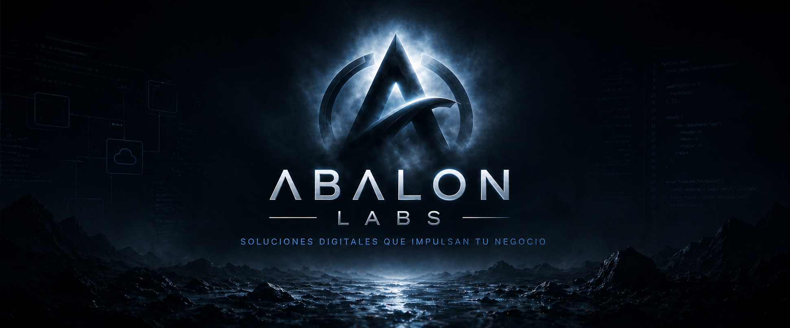
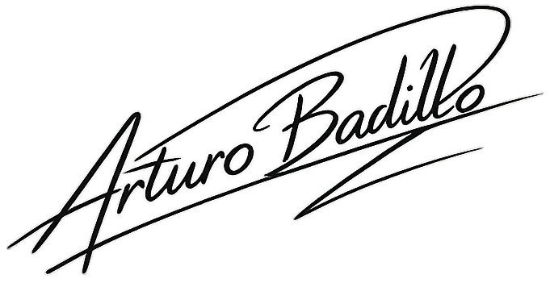

<p align="center">
  
</p>

<h1 align="center">Arturo David Badillo Arrieta</h1>

<p align="center">
  <strong>Ingeniero de Software | Desarrollador Full Stack | Máster de Ciberseguridad en formación | Fundador de Abalon Labs</strong>
</p>

<p align="center">
  
  
  
  
</p>

<p align="center">
  
</p>

<p align="center">
  <a href="https://portafolio-arturobadillo.vercel.app/">Portafolio</a> ·
  <a href="https://ec.linkedin.com/in/arturo-b-146815130">LinkedIn</a> ·
  <a href="mailto:arturobadillo18@gmail.com">Email</a> ·
  <a href="https://www.paypal.com/paypalme/arararcadabra">Apoyar proyectos</a>
</p>

<p align="center">
  
</p>

<p align="center">
  
</p>

Soy desarrollador Full Stack e ingeniero de software con enfoque en crear soluciones digitales completas: interfaces claras, backend sólido, bases de datos bien estructuradas y experiencias que generen valor real.

Actualmente fortalezco mi perfil académico cursando una maestría en Ciberseguridad. Me gusta construir aplicaciones web modernas, resolver problemas técnicos y convertir ideas en productos funcionales.

<p align="center">
  
</p>

### Perfil técnico en una línea

```text
Full Stack Developer · Software Engineering · Cybersecurity · Cloud Services · Product Thinking
```

<p align="center">
  
</p>

### Mi enfoque como desarrollador

- Construyo soluciones completas, no solo pantallas aisladas.
- Combino frontend, backend, bases de datos y criterio de producto.
- Me interesa que cada proyecto tenga una base técnica clara, mantenible y escalable.
- Valoro el orden, la documentación, la experiencia de usuario y la mejora continua.
- Integro una visión creciente de ciberseguridad en la forma en que diseño y desarrollo software.

<p align="center">
  
</p>

<details>
  <summary><strong>Ver stack técnico completo</strong></summary>

### Habilidades técnicas

#### Lenguajes de programación

<p>
  
  
  
  
  
</p>

#### Frontend

<p>
  
  
  
  
  
  
</p>

#### Backend

<p>
  
  
  
  
</p>

#### Bases de datos y servicios

<p>
  
  
  
  
</p>

#### Herramientas y plataformas

<p>
  
  
  
  
  
  
  
</p>

#### Áreas técnicas

```text
Desarrollo Full Stack · Desarrollo web · Arquitectura de software · Bases de datos
APIs REST · Autenticación · Supabase Storage · Soporte TIC · Automatización
Ciberseguridad · Ethical Hacking · Redes · Análisis de requerimientos
```

</details>

<p align="center">
  
</p>

### En qué estoy trabajando

- Desarrollo de aplicaciones web Full Stack.
- Proyectos personales y freelance.
- Integración con servicios en la nube, autenticación y almacenamiento.
- Mejora continua en backend, seguridad y arquitectura.

<p align="center">
  
</p>

### Actualmente estoy fortaleciendo

- Arquitectura backend con Java y Spring Boot.
- Desarrollo Full Stack con Next.js, React, Supabase, entre otros.
- Seguridad web, análisis de vulnerabilidades y buenas prácticas defensivas.
- Diseño de productos digitales bajo la marca Abalon Labs.
- Despliegue, mantenimiento y mejora continua de aplicaciones web.

<p align="center">
  
</p>

### Roadmap actual

- [x] Portafolio profesional interactivo
- [x] Proyectos web personales y freelance
- [x] Construcción de identidad tecnológica con Abalon Labs
- [X] Profundizar en seguridad ofensiva y defensiva
- [X] Publicar más proyectos open source
- [X] Consolidar productos digitales propios

<p align="center">
  
</p>

### Cómo pienso al construir software

```text
Problema real
   ↓
Requerimientos claros
   ↓
Diseño de solución
   ↓
Frontend usable + backend sólido
   ↓
Datos organizados
   ↓
Seguridad, despliegue y mejora continua
```

<p align="center">
  
</p>

### Proyectos destacados

<table>
  <tr>
    <td width="50%">
      <h3>Malevolens</h3>
      <p>Aplicación web con identidad visual moderna y funcionalidades orientadas a una experiencia digital completa.</p>
      <p><strong>Enfoque:</strong> Full Stack / UI</p>
    </td>
    <td width="50%">
      <h3>Reppost</h3>
      <p>Plataforma enfocada en gestión y publicación de contenido, integrando lógica de negocio e interfaz clara.</p>
      <p><strong>Enfoque:</strong> Web / Red social</p>
    </td>
  </tr>
  <tr>
    <td width="50%">
      <h3>CyberScan</h3>
      <p>Herramienta relacionada con análisis técnico y ciberseguridad, pensada para exploración, diagnóstico y aprendizaje.</p>
      <p><strong>Enfoque:</strong> Ciberseguridad</p>
    </td>
    <td width="50%">
      <h3>Plataforma UEC</h3>
      <p>Sistema institucional para organizar información, procesos y administración interna.</p>
      <p><strong>Enfoque:</strong> Sistema web</p>
    </td>
  </tr>
  <tr>
    <td width="50%">
      <h3>Portafolio profesional</h3>
      <p>Portafolio editable construido con Next.js, TypeScript y Supabase para presentar mi perfil y trayectoria.</p>
      <p><strong>Enfoque:</strong> Next.js / Supabase</p>
    </td>
    <td width="50%">
      <h3>Abalon Labs</h3>
      <p>Marca personal enfocada en software, automatización y productos digitales con identidad propia.</p>
      <p><strong>Enfoque:</strong> Producto / Marca tech</p>
    </td>
  </tr>
</table>

<p align="center">
  
</p>

### Actividad en GitHub

<p align="center">
  
</p>

<p align="center">
  
</p>

<p align="center">
  <picture>
    <source media="(prefers-color-scheme: dark)" srcset="https://raw.githubusercontent.com/ArturoB5/ArturoB5/output/github-contribution-grid-snake-dark.svg" />
    <source media="(prefers-color-scheme: light)" srcset="https://raw.githubusercontent.com/ArturoB5/ArturoB5/output/github-contribution-grid-snake.svg" />
    
  </picture>
</p>

<p align="center">
  
</p>

### Abalon Labs

Estoy construyendo **Abalon Labs** como una marca personal enfocada en desarrollo de software, soluciones digitales, automatización y proyectos tecnológicos con identidad propia.

Mi objetivo es convertir ideas en productos funcionales, visualmente cuidados y técnicamente sólidos.

<p align="center">
  
</p>

### Conecta conmigo

<p align="center">
  <a href="https://ec.linkedin.com/in/arturo-b-146815130">
    
  </a>
  <a href="https://portafolio-arturobadillo.vercel.app/">
    
  </a>
  <a href="mailto:arturobadillo18@gmail.com">
    
  </a>
</p>

<p align="center">
  
</p>

## Invítame un café

Si quieres apoyarme creando nuevos proyectos:

<a href="https://www.paypal.com/paypalme/arararcadabra?locale.x=es_XC&country.x=EC" target="_blank">
  
</a>

<p align="center">
  
</p>

<p align="center">
  
</p>

<p align="center">
  <strong>Construyendo software con intención, orden y mejora continua en cada commit.</strong>
</p>
